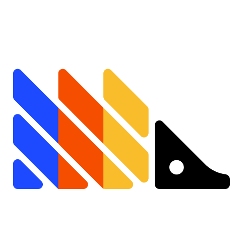

<p align="center">
  
</p>

<h1 align="center">PostHog for VS Code</h1>

<p align="center">
  <strong>Feature flags, experiments, event analytics, and session replay — inline in your editor.</strong>
</p>

<p align="center">
  <a href="https://marketplace.visualstudio.com/items?itemName=PostHog.posthog-vscode"></a>
  <a href="https://marketplace.visualstudio.com/items?itemName=PostHog.posthog-vscode"></a>
  <a href="LICENSE"></a>
</p>

---

## What it does

PostHog for VS Code brings your product analytics stack into the editor. See feature flag status, experiment results, event volumes, and session replay data right next to the code that uses them — no browser tab required.

---

## Quick Start

1. **Install** the extension from the [VS Code Marketplace](https://marketplace.visualstudio.com/items?itemName=PostHog.posthog-vscode)
2. **Sign in** — open the PostHog sidebar (hedgehog icon in the activity bar) and authenticate with a [personal API key](https://posthog.com/docs/api#personal-api-keys) (`phx_...`) or sign in with your PostHog account
3. **Select your project** when prompted
4. **Done** — the sidebar populates with your flags, experiments, and analytics. Inline decorations appear in your code automatically.

---

## Features

### Inline Code Intelligence

The core of the extension. Your PostHog data appears directly in your editor as you write code.

- **Flag status decorations** — see flag state inline after every flag call: `● enabled`, `○ inactive`, rollout %, variant count, or `⚠ not in PostHog`
- **Event volume and sparklines** — 7-day event count and inline sparkline chart next to every `capture()` call
- **Experiment results inline** — flags linked to experiments show live status like `⚗ test leading 72%`
- **Variant code path highlighting** — color-coded highlighting of if/else and switch branches behind experiment variants, with rollout percentages
- **Flag key autocomplete** — suggestions from your PostHog project inside `isFeatureEnabled('`, `getFeatureFlag('`, etc.
- **Event name autocomplete** — suggestions inside `posthog.capture('`
- **Event property autocomplete** — property names, types, and top values as you build event payloads
- **Variant autocomplete** — variant keys for multivariate flags
- **Unknown flag detection** — yellow wavy underline on flag keys that don't exist in PostHog, with a quick-fix to create them
- **Event naming diagnostics** — Levenshtein-based typo detection for event names that look similar to existing events
- **Flag CodeLens** — contextual actions above flag calls (open detail, view experiment)
- **Session CodeLens** — "X sessions / Y users in 24h" above capture and flag calls
- **Cmd+click navigation** — flag keys become links that open the flag or experiment detail panel

### Sidebar Dashboard

A tabbed overview of your PostHog project, accessible from the activity bar.

- **Flags tab** — all feature flags with search, filter by status, toggle, and rollout editing
- **Experiments tab** — experiments with status indicators, results summary, and start/stop actions
- **Analytics tab** — saved insights from your PostHog project with auto-refresh
- **"My Flags" filter** — quickly show only flags you created
- **Stale Flags tree view** — dedicated tree view below the sidebar for codebase-wide flag hygiene

### Flag Management

Create, toggle, and configure flags without leaving the editor.

- **Toggle flags from code** — code action with confirmation dialog
- **Edit rollout %, variants, and payloads** — full flag editor in a detail panel
- **Create flags from unknown keys** — quick-fix on unrecognized flag keys creates the flag in PostHog
- **Generate TypeScript types** — right-click context menu action to generate types from flag payload configurations
- **Copy flag key** — one-click copy to clipboard
- **Open in PostHog** — jump to the flag in the PostHog dashboard
- **Wrap selection in flag** — code action to wrap a code block in a feature flag check

### Stale Flag Cleanup

Find and remove tech debt from shipped or abandoned flags.

- **AST-based codebase scanning** — finds all flag references across your project using tree-sitter
- **4 staleness categories** — fully rolled out, inactive, experiment complete, not in PostHog
- **Tree view** — grouped by staleness reason, click to navigate to each reference
- **Inline refactoring** — code actions to remove flag checks and keep the correct code branch (handles if/else and ternary patterns)
- **Batch cleanup** — clean up all references for a stale flag at once
- **Report export** — export stale flag findings

### Session Replay

Connect code to real user sessions.

- **Session count CodeLens** — see session and user counts above capture and flag calls
- **Embedded replay** — watch session recordings in detail panels without leaving VS Code

### Team Configuration

Share PostHog settings across your team and manage multi-project workspaces.

- **Shared `.posthog.json` config** — commit project settings to your repo so the whole team connects automatically
- **Multi-project workspace support** — different workspace folders can target different PostHog projects
- **RBAC awareness** — read-only mode when your API key lacks write permissions
- **Status bar indicator** — shows active project, host, and last sync time. Click to switch projects.
- **Periodic cache refresh** — flags, events, and experiments stay in sync automatically

---

## Commands

All commands are available via the Command Palette (`Cmd+Shift+P` / `Ctrl+Shift+P`):

| Command | Description |
|---------|-------------|
| `PostHog: Sign In` | Connect with a personal API key |
| `PostHog: Sign In with PostHog` | Connect via OAuth |
| `PostHog: Sign Out` | Disconnect from PostHog |
| `PostHog: Select Project` | Switch between projects |
| `PostHog: Refresh Feature Flags` | Re-fetch flags, events, and experiments |
| `PostHog: Create Feature Flag` | Create a new flag in PostHog |
| `PostHog: Copy Flag Key` | Copy a flag key to clipboard |
| `PostHog: Open in PostHog` | Open the flag in the PostHog dashboard |
| `PostHog: Show Flag Detail` | Open flag detail panel in an editor tab |
| `PostHog: Show Experiment Detail` | Open experiment detail panel in an editor tab |
| `PostHog: Watch Sessions` | Open session replay for a flag or event |
| `PostHog: Generate Flag Types` | Generate TypeScript types from all flag configs |
| `PostHog: Generate Type` | Generate TypeScript type for a specific flag (context menu) |
| `PostHog: Scan for Stale Flags` | Find stale flag references across the codebase |
| `PostHog: Clean Up Stale Flag` | Remove a stale flag check from code |

---

## Settings

Configure the extension under `posthog.*` in VS Code settings:

| Setting | Default | Description |
|---------|---------|-------------|
| `posthog.additionalClientNames` | `[]` | Extra variable names to recognize as PostHog clients (e.g. `toolbarPosthogJS`, `telemetry`) |
| `posthog.additionalFlagFunctions` | `[]` | Bare function names that accept a flag key as the first argument (e.g. `useFeatureFlag`) |
| `posthog.detectNestedClients` | `true` | Detect PostHog calls through nested member expressions like `window.posthog?.capture()` |
| `posthog.showInlineDecorations` | `true` | Show inline flag status and event volume decorations in the editor |
| `posthog.useWorkspaceConfig` | `true` | Automatically load team settings from `.posthog.json` in the workspace root |
| `posthog.multiProjectNotifications` | `true` | Show a notification when a file belongs to a different PostHog project |

---

## Supported Languages

Code intelligence (autocomplete, decorations, diagnostics, code actions) works in:

- JavaScript
- TypeScript
- JSX / TSX

Powered by [tree-sitter](https://tree-sitter.github.io/tree-sitter/) for accurate AST-based detection. React hooks like `useFeatureFlag` are auto-detected.

---

## Team Setup

Share PostHog configuration with your team by committing a `.posthog.json` file to your workspace root:

```json
{
  "host": "https://us.posthog.com",
  "projectId": 12345,
  "additionalClientNames": ["analytics"],
  "additionalFlagFunctions": ["useMyFlag"]
}
```

When present, the extension reads this file on startup and applies the settings automatically. In a multi-root workspace, each folder can have its own `.posthog.json` targeting a different project.

---

## Development

```bash
pnpm install          # install dependencies
pnpm compile          # webpack build
pnpm watch            # webpack watch mode
pnpm lint             # run eslint
pnpm test             # run tests
# Press F5 in VS Code to launch the Extension Development Host
```

---

## Requirements

- VS Code 1.109.0 or later
- A [PostHog](https://posthog.com) account with a personal API key

---

## Contributing

Contributions are welcome. Open an issue or pull request on [GitHub](https://github.com/PostHog/posthog-vscode).

---

## License

[MIT](LICENSE)

<p align="center">
  Built by the PostHog community
</p>
